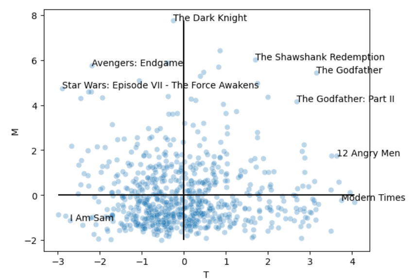
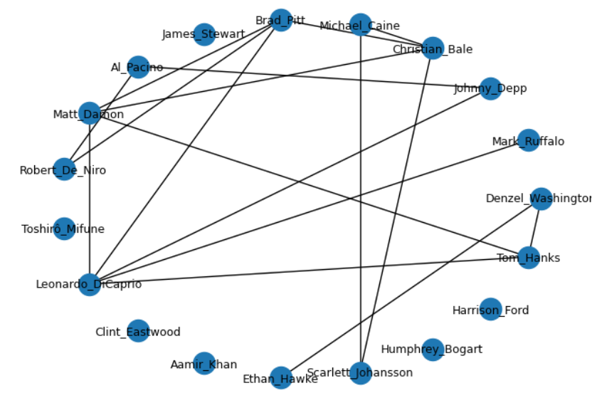
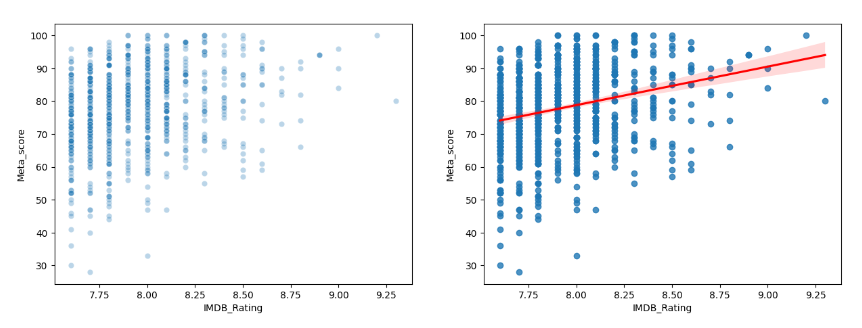

# Analysis of the IMDB Movies Dataset
The [IMDB Movies Dataset](https://www.kaggle.com/datasets/harshitshankhdhar/imdb-dataset-of-top-1000-movies-and-tv-shows) available on Kaggle contains data on 
the 1000 Top Rated movies by the IMDB Score. This repository stores the [Jupyter Notebook](https://github.com/vitormarquesr/imdb_top_movies_eda/blob/main/imdb-movies-eda.ipynb) of my data analysis on the dataset.

## Glimpse

### Multivariate Analysis
Principal Component Analysis (PCA) was used to create indexes that assess two facets of a movie and then plotted movies on a cartesian plane according to their compound characteristics.

### Network Analysis
In order to analyze which actors and genres usually feature together in movies, network analysis methods were necessary.

### Linear Regression
Linear regression was employed to investigate when the specialized critics and the general audience disagreed on the quality of a movie.

